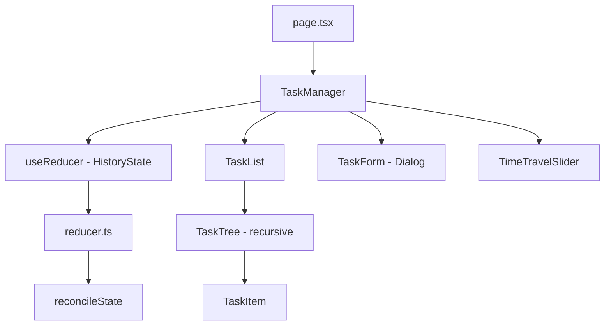
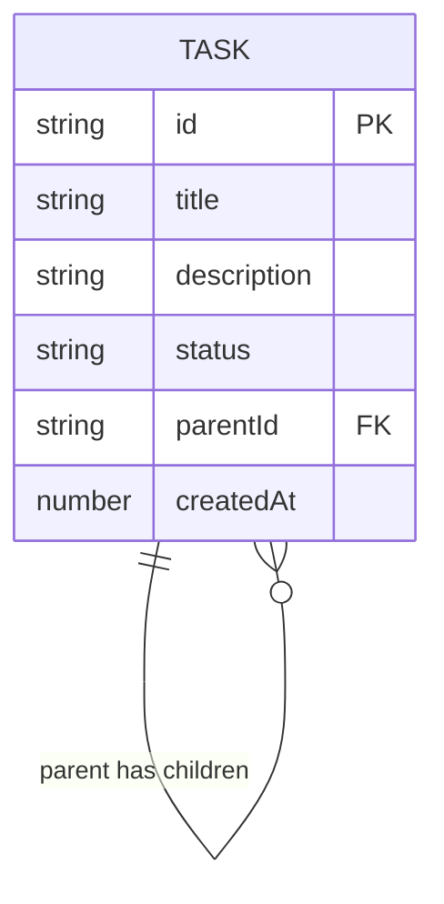
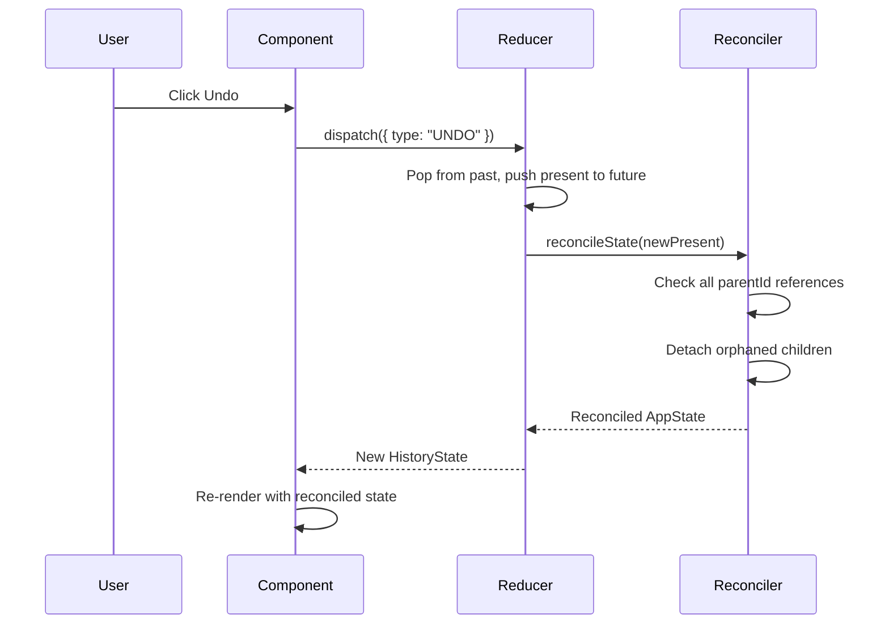

# Design Document

## Overview

A single-page Next.js application where all state lives in a React `useReducer` hook. No API routes, no database. The core architectural decision is an immutable snapshot history that enables time-travel via a slider. Dependency reconciliation (detach strategy) runs as a pure function on every state transition.

## Tech Stack

| Layer | Technology | Rationale |
|-------|-----------|-----------|
| Framework | Next.js 14+ (App Router) | Industry standard, TypeScript-first |
| Language | TypeScript (strict) | Type safety for complex state model |
| State | React useReducer | Sufficient for single-page state, no external lib overhead |
| UI | shadcn/ui + Tailwind CSS | Pre-built accessible components, rapid assembly |
| Icons | Lucide React | Bundled with shadcn |
| ID Generation | crypto.randomUUID() | Browser-native, no dependency |
| Deployment | Vercel | Zero-config Next.js hosting |

## Architecture

### System Architecture



All data flows through a single reducer. Components dispatch actions and read from the present state. No prop drilling beyond one level — TaskManager passes state and dispatch to direct children.

### Component Breakdown

#### TaskManager (`components/task-manager.tsx`)
- **Responsibility:** Top-level orchestrator. Owns `useReducer(historyReducer, initialState)`. Renders all child components.
- **Dependencies:** reducer.ts, all child components.
- **Key Pattern:** Single source of truth. All state reads come from `state.present`.

#### TaskList (`components/task-list.tsx`)
- **Responsibility:** Filters top-level tasks (parentId === null), renders each as a TaskTree.
- **Dependencies:** TaskTree component.

#### TaskTree (`components/task-tree.tsx`)
- **Responsibility:** Recursive component. Renders a TaskItem and its children. Children are found by filtering tasks where parentId matches current task id.
- **Dependencies:** TaskItem component, self (recursive).
- **Key Pattern:** Recursive rendering with indentation via CSS margin-left or padding-left.

#### TaskItem (`components/task-item.tsx`)
- **Responsibility:** Single task card. Displays title, description, status badge. Provides edit, delete, and status change actions.
- **Dependencies:** shadcn Card, Badge, DropdownMenu, Button.

#### TaskForm (`components/task-form.tsx`)
- **Responsibility:** Create and edit task dialog. Title input, description textarea, parent selector, status selector.
- **Dependencies:** shadcn Dialog, Input, Textarea, Select.

#### TimeTravelSlider (`components/time-travel-slider.tsx`)
- **Responsibility:** History navigation. Slider maps to timeline index. Undo/Redo buttons.
- **Dependencies:** shadcn Slider, Button. Lucide ArrowLeft, ArrowRight icons.

### Data Model



### State Shape

```typescript
// lib/types.ts

type TaskStatus = "todo" | "in-progress" | "done";

interface Task {
  id: string;
  title: string;
  description: string;
  status: TaskStatus;
  parentId: string | null;
  createdAt: number;
}

interface AppState {
  tasks: Record<string, Task>;
}

interface HistoryState {
  past: AppState[];
  present: AppState;
  future: AppState[];
  timeline: AppState[];
  pointer: number;
}

type Action =
  | { type: "ADD_TASK"; payload: { title: string; description?: string; parentId?: string | null } }
  | { type: "UPDATE_TASK"; payload: { id: string; updates: Partial<Pick<Task, "title" | "description" | "status">> } }
  | { type: "DELETE_TASK"; payload: { id: string } }
  | { type: "UNDO" }
  | { type: "REDO" }
  | { type: "TIME_TRAVEL"; payload: { index: number } };
```

### Reconciliation Logic

```typescript
// lib/reducer.ts (core function)

function reconcileState(state: AppState): AppState {
  const existingIds = new Set(Object.keys(state.tasks));
  let needsReconciliation = false;

  for (const task of Object.values(state.tasks)) {
    if (task.parentId && !existingIds.has(task.parentId)) {
      needsReconciliation = true;
      break;
    }
  }

  if (!needsReconciliation) return state;

  const reconciledTasks: Record<string, Task> = {};
  for (const [id, task] of Object.entries(state.tasks)) {
    if (task.parentId && !existingIds.has(task.parentId)) {
      reconciledTasks[id] = { ...task, parentId: null };
    } else {
      reconciledTasks[id] = task;
    }
  }

  return { tasks: reconciledTasks };
}
```

**When reconciliation runs:**
- After every UNDO action
- After every REDO action
- After every TIME_TRAVEL (slider) action
- After every DELETE_TASK action (to clean up children)

### Reducer Flow (Sequence Diagram)



## Project Structure

```
src/
├── app/
│   ├── layout.tsx
│   ├── page.tsx
│   └── globals.css
├── components/
│   ├── task-manager.tsx
│   ├── task-list.tsx
│   ├── task-tree.tsx
│   ├── task-item.tsx
│   ├── task-form.tsx
│   └── time-travel-slider.tsx
├── lib/
│   ├── types.ts
│   ├── reducer.ts
│   ├── utils.ts
│   └── initial-data.ts
└── components/ui/          ← shadcn generated components
    ├── button.tsx
    ├── card.tsx
    ├── dialog.tsx
    ├── input.tsx
    ├── textarea.tsx
    ├── select.tsx
    ├── slider.tsx
    ├── badge.tsx
    └── dropdown-menu.tsx
```

## Deployment Strategy

- `vercel deploy` from Git repo or CLI.
- No environment variables needed (no backend).
- Static export possible via `next.config.js` → `output: 'export'` if needed.

## Security Considerations

- No backend = no server-side attack surface.
- No user input is persisted or sent anywhere.
- XSS: React's default escaping handles rendered user input.
- No external API calls, no CORS concerns.
